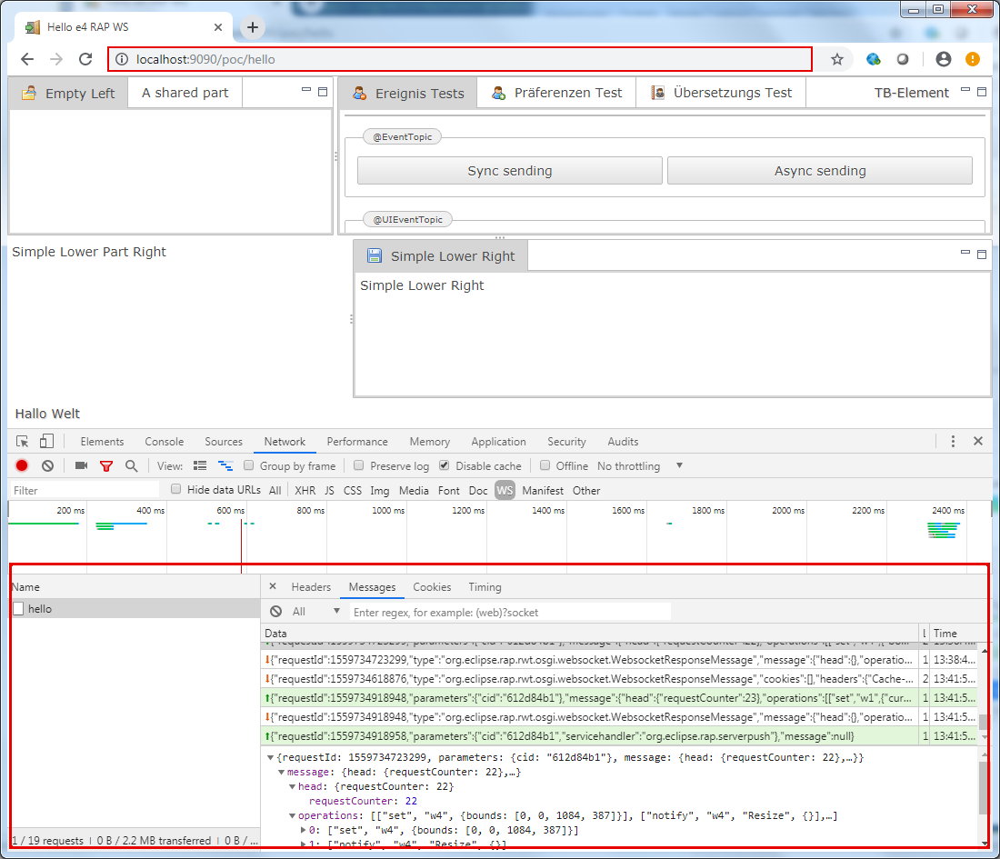

PoC Websockets for Eclipse RAP
=================================================

This project is just a proof of concept and therefore as dirty as it is. It's here only for the use, to get an idea how much effort it will take to bring RAP and JSR356 together.
The main driver for the idea is to decrease network latency to make RAP applications behave smooth even on a network with a perceptible round trip time ( proxy, firewall, ssl-handshake and so on ).  

Git Repository Structure
------------------------

| directory   | content                                                     |
|-------------|-------------------------------------------------------------|
| `cnf/`  | bnd workspace                                         |
| `org.eclipse.jetty.osgi.httpservice.websocket/`    | replacement for `org.eclipse.jetty.osgi.httpservice` to enable jsr356 websockets                                       
| `org.eclipse.rap.rwt.osgi.websocket/`   | main project to wrap the client-server communication within a websocket|

Run the RAP Demo Applications
--------------------

Run the following command from the root of the Git repository (at least JDK-8 required):

    gradlew build resolve.rap-controls-demo run.rap-controls-demo

or

    gradlew build resolve.rap-examples-demo run.rap-examples-demo

After the application is built and started, point your browser to http://localhost:9090.

The workbench based demos could be run by:

    gradlew build resolve.rap-workbench-demo run.rap-workbench-demo

which provides the entrypoints
- http://localhost:9090
- http://localhost:9090/app
- http://localhost:9090/business
- http://localhost:9090/fancy
- http://localhost:9090/databinding

You can also start the RAP E4 Demo application (at least JDK-9 required) by:

    gradlew build resolve.rap-e4-demo run.rap-e4-demo

which can be found at http://localhost:9090/hello

You should now be able to inspect the traffic with the tool of your choice.
As an example, how it should look like, here is a screen shoot of [Chrome DevTools][5]  

License
-------

[Eclipse Public License (EPL) v2.0][6]

Known Limitations / Todos
-------
- FileUpload not working - needs to be revisited
- bundle load order matters for 
`o.e.j.osgi.httpservice.websocket` and `o.e.j.websocket.javax.websocket.server` because of the ServiceLoader runtime dependency, which can't be expressed by Require-Capability see also [Jetty 3543][9]
- [OSGI Http Whiteboard Spec][10] lacks support for websockets hopefully it shows up in future releases see also [Liferay Doc][11] and [Liferay Git][12]   

[1]: http://eclipse.org/rap
[2]: https://github.com/eclipse/rap/tree/master/examples/org.eclipse.rap.e4.demo
[3]: https://bugs.eclipse.org/bugs/show_bug.cgi?id=547896
[4]: http://localhost:9090/poc/hello
[5]: https://developers.google.com/web/tools/chrome-devtools/
[6]: https://www.eclipse.org/legal/epl-2.0/
[7]: https://bugs.eclipse.org/bugs/show_bug.cgi?id=547895
[8]: https://www.eclipse.org/rap/demos/
[9]: https://github.com/eclipse/jetty.project/issues/3543
[10]: https://osgi.org/specification/osgi.cmpn/7.0.0/service.http.whiteboard.html
[11]: https://dev.liferay.com/de/develop/tutorials/-/knowledge_base/7-0/liferay-websocket-whiteboard
[12]: https://github.com/liferay/liferay-portal/tree/master/modules/apps/websocket
